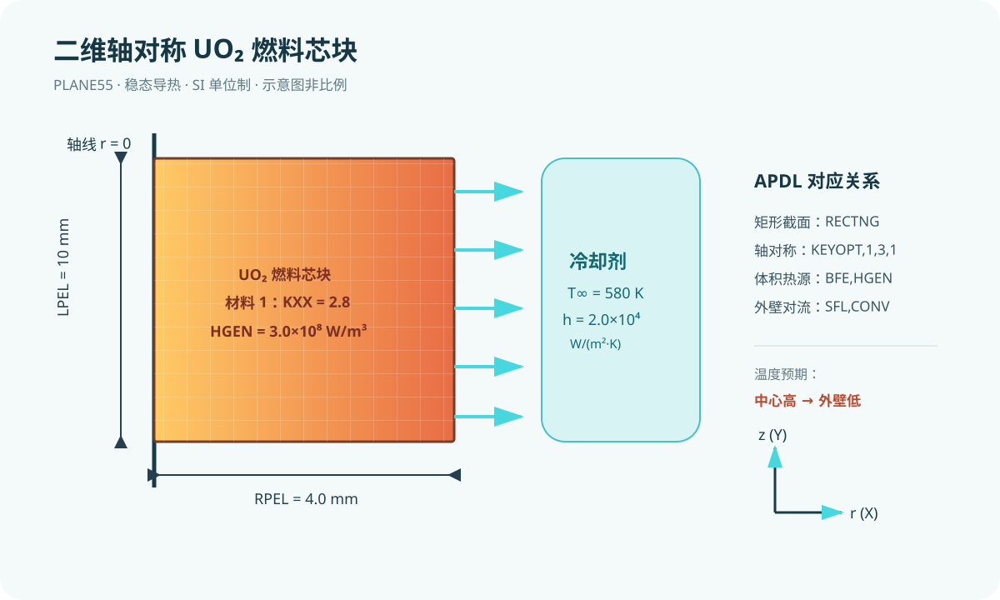

# 第 1 课：燃料芯块模型的 APDL 结构、单位制与参数化

## 今日目标

建立一个采用 SI 单位制的二维轴对称 UO₂ 燃料芯块稳态导热示例，并能在后处理中读取最高温度。

## 物理问题

模型用半径 `RPEL=0.004 m`、长度 `LPEL=0.010 m` 的短燃料芯块代表燃料棒中的局部轴向段。芯块有均匀体积热源 `QGEN=3.0E8 W/m³`，外圆周与冷却剂之间用 `HCOOL=2.0E4 W/(m²·K)` 和 `TBULK=580 K` 表示对流换热。这里的数值只用于 APDL 学习，不是任何堆型的设计输入。

采用 **m–kg–s–K–W–Pa** 的 SI 单位制。APDL 不会替用户检查单位；导热系数、体积热源、对流系数和几何尺寸必须与它一致。示例没有包壳、间隙或轴向端面换热，因此只适合作为命令和量纲检查的起点。

## 关键命令

- `/PREP7`：进入前处理。
- `ET,1,PLANE55`：定义二维热传导单元；`KEYOPT,1,3,1` 设为轴对称。
- `MP,KXX,1,KUEL`：为材料 1 指定导热系数。
- `RECTNG` 与 `AMESH`：建立并网格化截面。
- `BFE,ALL,HGEN,,QGEN`：向全部单元施加体积热源。
- `SFL,ALL,CONV,HCOOL,TBULK`：向选定外边界施加对流边界。
- `ANTYPE,STATIC`：稳态热分析。
- `PLNSOL,TEMP` 与 `*GET`：显示温度场并提取最大温度。

完整输入文件见 [example.inp](/D:/codex/Xmol/apdl-tutorials/2026-09-11/example.inp)。

## 预期结果

温度应从外表面对流边界向芯块中心升高。改变 `QGEN` 应提高最高温度；提高 `HCOOL` 应降低最高温度。不要把未实际求解的数值当作结果。

## 验证清单

- 检查 `RPEL` 和 `LPEL` 是否以米输入，`QGEN` 是否为 W/m³。
- 用体积积分的发热功率与外表面对流散热作能量平衡检查。
- 将单元尺寸从 `RPEL/12` 减半，比较最高温度的变化。
- 检查外圆边界是否确实由 `LSEL,S,LOC,X,RPEL` 选中。

## 常见错误

1. 把毫米数值直接写入米制模型，会使体积热源总功率失真九个数量级。先统一单位再建模。
2. 忘记设置轴对称选项，会把模型当作平面薄片计算。检查 `KEYOPT,1,3,1`。
3. 在 `SFL` 前未正确选择外圆线，导致对流施加在错误边界。用 `LPLOT` 或选择计数核查。

## 练习

1. 将 `QGEN` 分别改为 `2.0E8` 与 `4.0E8 W/m³`，记录最高温度并检查趋势。
2. 增加一层包壳和燃料—包壳间隙；下一课将进一步处理燃料棒径向导热。

## 验证状态

本教程只完成静态检查，尚未在本机 MAPDL 中实际求解。
