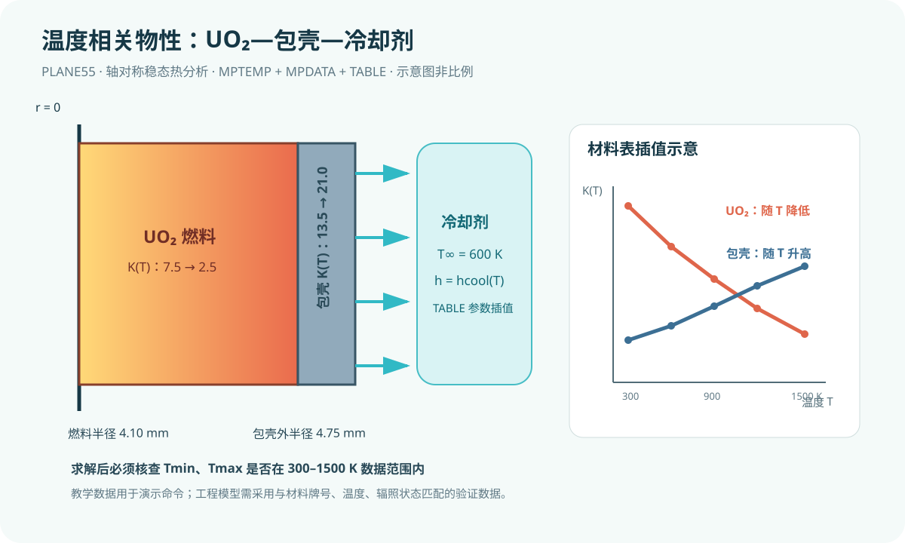

# 第4课：UO₂、包壳与冷却剂的温度相关材料属性

## 今日目标

在轴对称燃料棒稳态热分析中，用 `MPTEMP` 与 `MPDATA` 输入 UO₂ 和包壳的分段温度相关导热率，并用参数表管理冷却剂温度与换热系数。

## 物理问题

模型沿用上一课的 UO₂ 芯块—包壳轴对称截面，采用 SI 单位制（m、kg、s、K、W、Pa）。燃料半径 4.10 mm，包壳外半径 4.75 mm，轴向建模长度 0.10 m。燃料均匀发热，包壳外表面与冷却剂对流换热。

本课用教学用示例表展示温度插值方法：UO₂ 导热率随温度升高而降低，包壳导热率随温度升高略有增加。数值只用于学习命令，不应直接用于反应堆设计或安全分析。冷却剂在稳态实体外未单独划分网格，因此其温度相关性通过 `tbulk`、`hconv` 参数表表示；更高阶模型应由系统热工或 CFD 给出局部壁温、体温和换热系数。

## 关键命令

- `MPTEMP,1,...`：定义材料属性表的温度点，单位 K。
- `MPDATA,KXX,mat,1,...`：在相同温度点输入指定材料的导热率。
- `*DIM,...,TABLE`：建立以温度为自变量的 APDL 表参数。
- `*TAXIS`：为表参数写入温度坐标。
- `*SET`：定义标量参数并从表中读取工况值。
- `MPWRITE`：把材料数据写入文本文件，便于复核。
- `BFE,HGEN`：仅对燃料单元施加体积热源。
- `SFL,CONV`：在包壳外壁施加对流边界。

## 材料与边界数据

| 温度/K | UO₂ 导热率 W/(m·K) | 包壳导热率 W/(m·K) | 冷却剂换热系数 W/(m²·K) |
|---:|---:|---:|---:|
| 300 | 7.5 | 13.5 | 1.8×10⁴ |
| 600 | 5.0 | 15.0 | 2.5×10⁴ |
| 900 | 3.8 | 17.0 | 3.0×10⁴ |
| 1200 | 3.0 | 19.0 | 3.3×10⁴ |
| 1500 | 2.5 | 21.0 | 3.5×10⁴ |

MAPDL 会在给定温度点之间插值材料属性。超出表格范围时的外推可能产生不可靠结果，因此求解后必须检查温度是否落在数据覆盖区间内。

## 完整脚本

见同目录 [example.inp](example.inp)。示例同时导出最高温度和最低温度，便于检查是否超出 300–1500 K 的材料表范围。

## 预期结果

最高温度仍应出现在燃料中心线附近。与常数导热率模型相比，UO₂ 在高温区导热率下降会强化中心温升，温度分布不再与固定导热率解完全一致。脚本未经 MAPDL 实际求解，不给出虚构数值；运行后应查看温度云图与 `lesson4_results.txt`。

## 验证清单

1. **单位检查**：温度点使用 K，导热率使用 W/(m·K)，换热系数使用 W/(m²·K)。
2. **适用区间**：确认求解所得 `tmin` 与 `tmax` 都在 300–1500 K 内；若越界，应补充有依据的物性数据。
3. **趋势检查**：将 UO₂ 导热率改为常数 3.0 W/(m·K)，比较最高温度，确认材料非线性影响方向合理。
4. **迭代检查**：查看求解输出中的非线性迭代与收敛信息；温度相关材料会使热传导方程成为材料非线性问题。
5. **网格检查**：把单元尺寸从 0.20 mm 降至 0.10 mm，比较最高温度变化。

## 常见错误

1. `MPTEMP` 温度点与 `MPDATA` 数据错位：温度和属性必须按相同序号一一对应。
2. 把摄氏度直接当 K 输入：温度零点错误会改变插值位置，应统一为绝对温度。
3. 温度超出数据表仍直接采用结果：应扩充经验证的数据范围，不能依赖无依据的外推。

## 练习题

1. 将 UO₂ 的五个导热率分别降低 10%，比较最高温度，量化材料不确定性的敏感性。
2. 将 `coolant_case` 从 600 K 改为 900 K，使表参数自动更新换热系数；讨论燃料温度、包壳温度和材料数据覆盖范围如何变化。

> 后续瞬态课程会加入密度和比热；结构课程会加入弹性模量、泊松比与热膨胀系数的温度相关数据。工程分析应采用有出处、与材料牌号和辐照状态相匹配的数据库。
