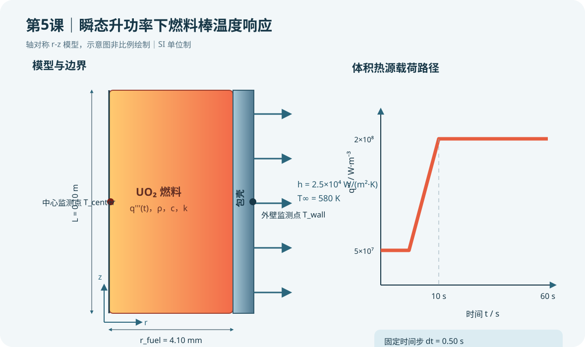

# 第5课：瞬态升功率下的燃料棒温度响应与时间步控制

## 今日目标

建立 UO₂ 燃料—包壳轴对称瞬态热模型，使体积热源在 10 s 内由低功率线性升至额定教学值，并比较燃料中心与包壳外壁的温度响应滞后。

## 物理问题

采用 SI 单位制（m、kg、s、K、W、Pa）。燃料半径 4.10 mm，包壳外半径 4.75 mm，轴向建模长度 0.10 m。燃料体积热源从 `5.0×10⁷ W/m³` 在 10 s 内升至 `2.0×10⁸ W/m³`，之后保持至 60 s。包壳外壁与 580 K 冷却剂对流换热，教学换热系数为 `2.5×10⁴ W/(m²·K)`。

瞬态导热除了导热率，还必须输入密度和比热，因为热惯性由体积热容 `ρc` 决定。本例把燃料和包壳界面粘合为完全导热，暂不考虑燃料—包壳间隙；第 9–10 课将加入间隙导热与接触状态。

## 关键命令

- `ANTYPE,TRANS`：指定瞬态分析。
- `TRNOPT,FULL`：采用完全法时间积分，保留热容量项。
- `TIMINT,ON,THERM`：对温度自由度启用时间积分。
- `DELTIM,dt`：指定时间步长；本例为 0.50 s。
- `TIME,time_now`：定义当前载荷步终止时间，必须单调增加。
- `KBC,1`：当前时间步内把显式载荷按阶跃保持；线性升功率由循环逐步计算 `qnow` 实现。
- `*DO`、`*IF`：按时间推进并在升功率/恒功率阶段切换公式。
- `OUTRES,TEMP,ALL`：保存每个子步温度，供完整时程后处理。
- `/POST26`、`NSOL`、`PLVAR`：提取并绘制指定节点温度时程。

## 载荷路径

| 时间 | 体积热源 | 说明 |
|---:|---:|---|
| 0 s | 5.0×10⁷ W/m³ | 先求该功率下稳态，作为瞬态初场 |
| 0–10 s | 线性增加 | 每 0.50 s 更新一次 `qnow` |
| 10–60 s | 2.0×10⁸ W/m³ | 保持功率并观察热惯性趋稳过程 |

## 完整脚本

见同目录 [example.inp](example.inp)。每条可执行命令和参数赋值均带中文行尾注释。脚本保存所有时间步温度结果，并输出燃料中心与包壳外壁时程。

## 预期结果

燃料中心温度应高于包壳外壁，并因燃料热容和径向导热产生响应滞后。10 s 升功率结束后，温度仍可能继续上升并逐渐趋于新稳态。若温度曲线出现无物理依据的尖峰或锯齿，应先检查时间步、载荷更新、初始稳态和材料单位。

本课只完成静态语法与物理一致性检查，没有运行 MAPDL，因此不报告虚构的最高温度数值。

## 验证清单

1. **初场检查**：确认瞬态从 `q_start` 的稳态结果开始，而不是从默认零温度开始。
2. **单位检查**：密度用 kg/m³、比热用 J/(kg·K)、热源用 W/m³、时间用 s。
3. **时间步敏感性**：分别采用 1.0、0.50 和 0.25 s，比较 10 s 时中心温度与最终温度。
4. **能量检查**：对燃料发热功率、外壁对流排热与模型内能变化进行量级核对。
5. **节点检查**：确认 `n_center` 位于 r=0、z=L/2，`n_wall` 位于 r=r_clad、z=L/2。

## 常见错误

1. 只给导热率、未给密度和比热：稳态可能求解，但瞬态热惯性没有物理基础。
2. `TIME` 没有递增或载荷循环没有覆盖全部燃料单元：会导致求解中止或局部漏载。
3. 用很大时间步仍声称捕捉 10 s 升功率细节：最终温度可能接近，但峰值时刻和相位滞后会失真。

## 练习题

1. 把 `dt` 依次改为 1.0、0.50、0.25 s，记录 10 s 和 60 s 的燃料中心温度，画出时间步收敛表。
2. 将升功率时间由 10 s 改为 2 s 和 30 s，比较中心—外壁温差峰值，并讨论更快升功率为何可能增加后续热应力。

> 下一课将把瞬态温度场传递到结构单元，计算包壳热膨胀与应力。工程分析应使用与燃料牌号、孔隙率、燃耗、辐照状态和冷却剂工况一致的物性及边界。
