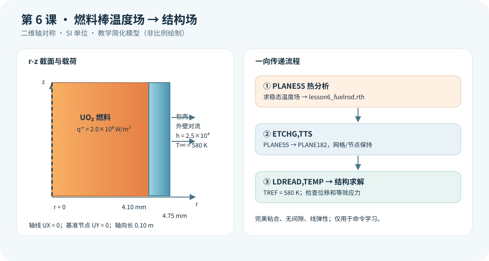

# 第6课：燃料温度场向包壳结构场传递

## 今日目标

先求 UO₂ 燃料与包壳的稳态温度场，再保持同一网格，将热单元改为结构单元，把 `.rth` 中的温度作为热膨胀载荷，查看位移和等效应力。

## 物理问题

统一采用 SI 单位（m、kg、s、K、W、Pa）。模型为长 0.10 m 的二维轴对称 `r-z` 截面：燃料半径 4.10 mm，包壳外半径 4.75 mm。燃料体积热源为 `2.0×10⁸ W/m³`；包壳外表面对 580 K 冷却剂对流，教学换热系数为 `2.5×10⁴ W/(m²·K)`。温度参考态也设为 580 K。

这是**无燃料—包壳间隙的完美粘合教学模型**。共节点界面使温度、径向位移连续；它会夸大实际未接触燃料棒的力学耦合，不应把所得应力直接当作工程评价值。燃料热膨胀、包壳温度梯度及材料膨胀系数差异共同决定结构响应。暂不考虑间隙导热、接触、内压、燃耗、辐照、塑性和蠕变。

## 关键命令

- `ET,1,PLANE55`、`KEYOPT,1,3,1`：定义轴对称热单元。
- `BFE,ALL,HGEN,,qvol`：仅向燃料单元施加体积热源。
- `SFL,ALL,CONV,hconv,tbulk`：给包壳外壁施加对流边界。
- `ETCHG,TTS`：保留网格，将 `PLANE55` 切换成结构 `PLANE182`；随后必须重新设置轴对称 `KEYOPT`。
- `SFLDELE`、`BFEDELE`：切换物理场前清理热边界与热源。
- `TREF,tbulk`：设定热应变的零参考温度。
- `LDREAD,TEMP,LAST,,,,lesson6_fuelrod,rth`：从末个热结果集读取温度，以节点体载荷传入结构分析。
- `D`：轴线约束径向位移，仅用一个基准点消除轴向刚体平移。
- `PLNSOL,U,SUM` 与 `PLNSOL,S,EQV`：查看位移和等效应力。

## 分析流程

1. 两块粘合面积共用节点，以 `PLANE55` 建立轴对称热模型，求解稳态温度并生成 `.rth`。
2. 清除热载荷，使用 `ETCHG,TTS` 转换为 `PLANE182`，补充两种材料的 `EX`、`PRXY`、`ALPX`，重新设置轴对称选项。
3. 约束轴线 `UX=0` 和轴线上一个节点 `UY=0`；`LDREAD` 导入节点温度，求解静态热弹性问题。
4. 核对温度、约束、位移和应力，再开展网格和参数敏感性比较。

## 完整脚本

见同目录的 [example.inp](example.inp)。每条可执行 APDL 命令和参数赋值都有中文行尾注释；`*VWRITE` 后的格式描述符遵循 APDL 语法保持为纯格式行。

## 预期结果

燃料中心温度通常高于包壳外壁。若热膨胀系数不同，粘合界面附近可能出现明显热应力；应力分布取决于约束和材料参数。不能根据教学参数推断真实燃料棒的峰值应力，也不能把节点最大值直接用作收敛判据。本课没有运行 MAPDL，故不填写计算数值。

## 验证清单

1. **热平衡**：估算发热量 `qvol·πr_fuel²·rod_length`，与包壳外表面对流排热量比较；若差异明显，检查面积选择和边界。
2. **网格与界面**：确认燃料与包壳有共用节点，并将 `esize_r` 缩小一半比较外壁温度、包壳中部应力。
3. **温度映射**：结构阶段确认 `LDREAD` 读取的是 `.rth` 最后热结果集，节点数量和编号未改变，且两种材料都接收温度。
4. **约束与单位**：只限制必要刚体位移；核对 K、Pa、W/m³、W/(m²·K)，以及 `TREF=580 K`。
5. **物理边界**：将 UO₂ 与包壳膨胀系数分别改变 ±20%，观察位移和界面应力的方向与灵敏度。

## 常见错误

1. `ETCHG,TTS` 后忘记重新指定 `KEYOPT,1,3,1`：结构场可能按平面应力分析，造成错误的环向应力。
2. 热网格和结构网格不同却直接使用 `LDREAD`：该命令按原节点映射；应保持同网格或使用经过验证的其他映射方法。
3. 把整个端面 `UY=0` 当作去刚体约束：端面轴向膨胀被额外钳制，会抬高热应力。

## 练习题

1. 将 `qvol` 分别设为 `1.0×10⁸`、`2.0×10⁸` 和 `3.0×10⁸ W/m³`，记录燃料中心温度、包壳中部等效应力与最大径向位移，并判断是否近似线性。
2. 在下一阶段加入燃料—包壳间隙及接触，比较“完美粘合”和“间隙尚未闭合”两种假设下的包壳应力，说明何时应转为非线性接触分析。

**核对依据**：[Ansys 2026 R1 的 VM32 热—结构验证算例](https://ansyshelp.ansys.com/public/Views/Secured/corp/v261/en/ans_vm/Hlp_V_VM32TXT.html)、[ETCHG 命令](https://ansyshelp.ansys.com/public/Views/Secured/corp/v252/en/ans_cmd/Hlp_C_ETCHG.html)、[LDREAD 命令](https://ansyshelp.ansys.com/public/Views/Secured/corp/v252/en/ans_cmd/Hlp_C_LDREAD.html)。本课只完成官方命令与结构的静态核对，具体求解需在有许可的 MAPDL 环境验证。
