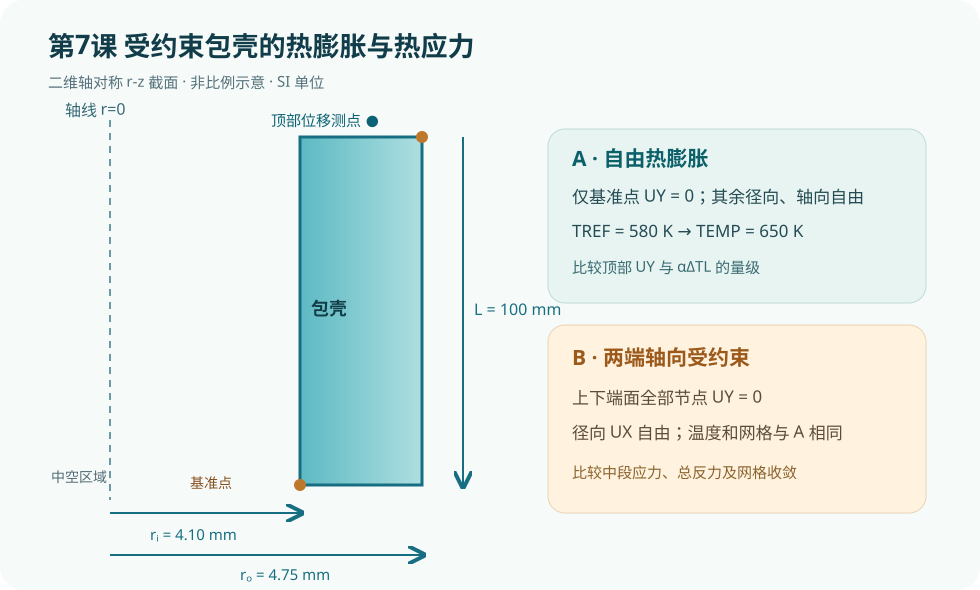

# 第7课：受约束包壳的热膨胀与热应力

## 今日目标

用同一包壳轴对称模型比较“仅消除刚体位移”和“两端轴向受约束”两种边界条件，理解温升本身与热膨胀受限如何分别影响位移和热应力。

## 物理问题

以燃料棒包壳为背景，建立内半径 4.10 mm、外半径 4.75 mm、轴向长度 100 mm 的中空圆柱二维 `r-z` 截面。用 `PLANE182` 轴对称结构单元，初始无应变温度为 580 K，工作温度为 650 K。统一使用 SI 单位：m、kg、s、K、Pa。教学材料参数为 `E=100 GPa`、`ν=0.33`、`α=5.5×10⁻⁶ K⁻¹`，并非特定包壳牌号的真实材料数据。

工况 A 仅固定底部内壁角点的轴向位移，抑制整体沿轴向平移，允许径向及轴向热膨胀；工况 B 将上下端面全部节点的 `UY` 固定，限制轴向热膨胀。包壳位于 `r>0` 的环形区域，径向不应额外固定为零。两个工况使用同一网格和同一温度，差别仅为轴向约束。该均匀温度、线弹性、无接触模型适合演示边界条件影响，不用于真实燃料棒寿命或安全评价。

## 关键命令

- `ET,1,PLANE182` 与 `KEYOPT,1,3,1`：定义轴对称二维结构单元，X 对应径向，Y 对应轴向。
- `MP,EX/PRXY/ALPX`：分别设置弹性模量、泊松比与线膨胀系数。
- `RECTNG`、`ESIZE`、`AMESH`：建立包壳截面并划分网格。
- `NSEL,S/R/A,LOC,...`：按位置筛选角点或两端面节点；每次施加载荷后用 `ALLSEL,ALL` 恢复选择集。
- `TREF`：给出热应变零参考温度；`BFUNIF,TEMP`：给没有指定其他体温载荷的单元提供均匀温度。
- `D` 与 `DDELE`：施加和删除位移约束，以便在同一网格上切换工况。
- `SOLVE`、`SET,LAST`、`*GET`：求解并提取轴向位移与节点等效应力。

## 分析流程

1. 建立轴对称包壳截面，记录底部内壁基准节点和顶部外壁测点。
2. 设置 `TREF=580 K`、`BFUNIF,TEMP,650 K`，仅约束基准节点 `UY=0`，求解自由膨胀工况。
3. 读取顶部测点 `UY` 和最大等效应力；删除该单点约束，把上下端全部节点 `UY=0`，再求解受约束工况。
4. 比较两工况结果和云图，并通过反力、网格细化及解析量级检验判断边界是否正确。

## 完整脚本

下载同目录的 [example.inp](example.inp)。每条可执行命令及参数行均有中文行尾注释；`*VWRITE` 后的 FORTRAN 格式描述符按 APDL 语法保留为纯格式行。

## 预期结果

自由工况顶部轴向位移的量级应接近 `αΔT L = 5.5×10⁻⁶×70×0.10 ≈ 3.85×10⁻⁵ m`，外半径自由径向位移量级约 `αΔT r_o ≈ 1.83×10⁻⁶ m`。均匀升温且无其他载荷时，自由工况理想热应力趋近于零；两端约束时轴向热应力的估计量级为 `EαΔT ≈ 38.5 MPa`。这些是解析量级核对值，**不是本机 MAPDL 运行结果**；端部局部峰值、数值误差和具体 von Mises 分布须以求解并检查收敛后为准。

## 验证清单

1. **单位与载荷**：温度用 K，弹性模量用 Pa，热膨胀系数用 1/K；确认两工况共享 `TREF` 和 `BFUNIF`，且没有意外保留其他节点温度载荷。
2. **边界与反力**：自由工况只有一个 `UY` 约束，径向自由；受约束工况检查两端 `UY=0`，轴向反力合力应成对平衡。端面被固定时，顶端 `UY=0` 是边界条件本身，不能当成独立验证指标。
3. **解析量级**：比较自由工况顶部位移与 `αΔTL`；比较受约束工况中段轴向应力与 `EαΔT` 的量级，不要求边缘峰值完全一致。
4. **网格敏感性**：把网格尺寸从 0.15 mm 缩小到 0.075 mm，比较中段应力和总反力；避免仅凭单个节点最大应力判断收敛。
5. **物理假设**：真实包壳还受径向温度梯度、内压、燃料接触、端塞约束、辐照和蠕变影响；发表研究需说明哪些因素被纳入、哪些因素经过敏感性排除。

## 常见错误

1. 忘记 `KEYOPT,1,3,1`，默认按平面应力算，丢失正确的环向应力与圆柱运动学。
2. 对中空环形包壳误把内壁全部 `UX=0` 当作轴线条件，人工压住径向热膨胀。
3. 比较两工况前未删除基准约束、未恢复完整节点选择集或叠加了旧温度载荷，导致约束和载荷不一致。

## 练习题

1. 把工作温度依次改为 610、650、690 K，记录自由顶部位移和受约束中段应力，检查其与温差是否近似线性。
2. 将均匀温度替换为包壳内外表面不同温度，逐步加入燃料接触和内压，区分温度梯度造成的弯曲/径向应力与端部约束造成的轴向应力。

**官方命令依据**：[PLANE182 轴对称单元](https://ansyshelp.ansys.com/public/Views/Secured/corp/v261/en/ans_elem/Hlp_E_PLANE182.html)、[BFUNIF 均匀体载荷温度](https://ansyshelp.ansys.com/public/Views/Secured/corp/v251/en/ans_cmd/Hlp_C_BFUNIF.html)、[DDELE 删除位移约束](https://ansyshelp.ansys.com/public/Views/Secured/corp/v252/en/ans_cmd/Hlp_C_DDELE.html)。本课仅完成静态检查，尚未在 MAPDL 中运行。
