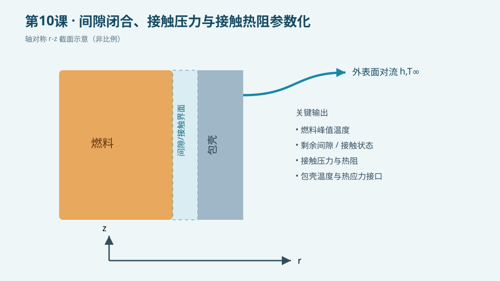

# 第10课：间隙闭合、接触压力与接触热阻参数化

## 今日目标

建立一个可复用的轴对称燃料—间隙—包壳教学模型，理解温度、热膨胀、间隙状态和界面传热之间的关系。

## 物理问题

采用 SI 单位制（m、kg、s、K、Pa）。模型表示一段长度为 0.10 m 的燃料棒 r-z 截面，燃料内生热，包壳外表面与冷却剂对流。示意图非比例。本课用于学习命令和建模链，不用于核安全评价；真实分析需采用经验证的燃料温度相关热物性、辐照膨胀、裂变气体压力、包壳蠕变及接触导热关联式。

## 关键命令

- `/PREP7`：进入前处理器，定义参数、材料、几何和网格。
- `PLANE55`：二维热传导单元；轴对称选项把截面旋转为圆柱体。
- `BFA,HGEN`：对燃料区域施加体积热源。
- `SFL,CONV`：在包壳外边界施加对流换热。
- `*IF`：根据剩余间隙选择开间隙或接触状态。
- `*DO`：对温度等参数做批量扫描。
- `*GET`：提取峰值温度等结果量。
- `*VWRITE`：把参数和结果写入文本，便于画图或再分析。

## 完整脚本

下载并运行 [example.inp](example.inp)。脚本每条可执行命令均附中文行尾注释。

## 预期结果

检查温度场是否从燃料中心向冷却剂方向单调降低。涉及间隙状态时，应确认热膨胀导致剩余间隙减小；间隙闭合后接触压力增大、界面热阻降低。当前文件标记为 `static_only`，因此不报告未经本机MAPDL求解的数值。

## 验证清单

1. 单位：体积热源为 W/m³，对流系数为 W/(m²·K)，应力为 Pa。
2. 边界：轴对称径向坐标必须是 X，轴向坐标是 Y。
3. 能量：稳态时外表面对流带走的热量应接近燃料总发热。
4. 网格：至少比较两种燃料、间隙和包壳网格尺寸。
5. 状态：开间隙/接触切换点附近应加密参数步长。

## 常见错误

- 把直径当半径输入，导致体积和线功率相差数倍。
- 只改变界面导热系数，却没有检查热膨胀和接触状态是否一致。
- 将教学罚刚度当真实材料参数；正式模型应由接触算法和试验标定。

## 练习题

1. 把燃料体积热源分别改为 1.5×10⁸、2.0×10⁸、2.5×10⁸ W/m³，比较峰值温度。
2. 将外表面对流温度改成瞬态入口温度历史，并讨论控制棒抽出引起升功率时的间隙闭合顺序。
