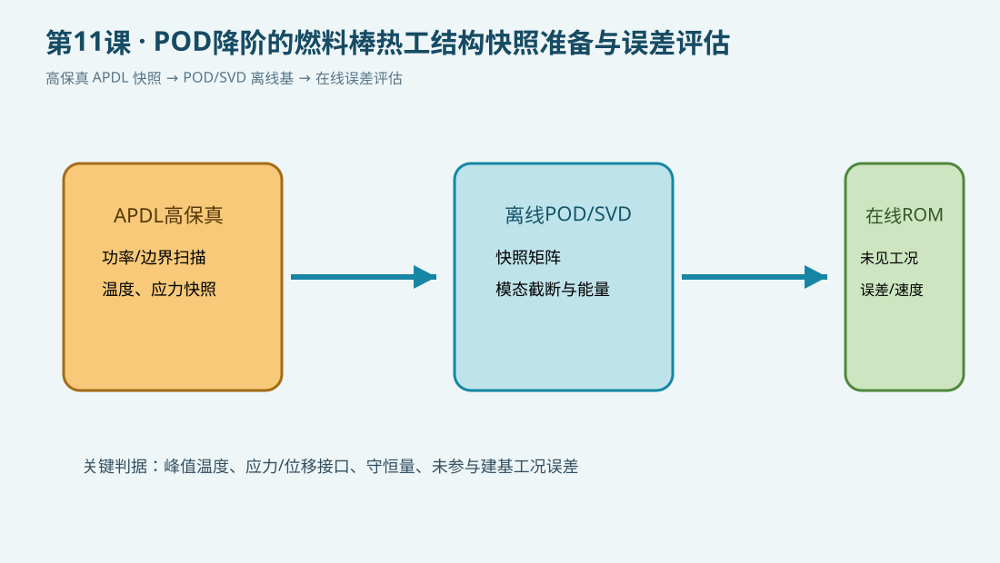

# 第11课：POD降阶的燃料棒热工结构快照准备与误差评估

## 今日目标

用 APDL 生成一组燃料—间隙—包壳稳态热场快照，明确 POD/SVD 的离线输入、在线输出和误差验证边界。POD 分解在外部脚本或 Python 中完成，APDL 负责可追溯的高保真样本生成。

## 物理问题

采用 SI 单位制。燃料体积热源在五个功率工况下扫描，包壳外表面施加对流边界；每个工况求得温度场，并将峰值、平均值和工况参数写入文本。正式研究时应把温度场、热应力、位移和接触量组成快照矩阵，使用未参与建基的工况做盲验证。

## 关键命令

- `/PREP7`、`RECTNG`、`AMESH`：建立轴对称热模型并划分网格。
- `*DO`：扫描功率工况，生成离线快照。
- `SOLVE`、`*GET`、`*VWRITE`：求解、提取并保存快照摘要。

## 完整脚本

下载 [example.inp](example.inp)。每条可执行命令均附中文行尾注释；`static_only` 表示本机未运行 MAPDL，不宣称数值已经求解验证。

## POD 工作链

1. APDL 离线扫描功率、边界温度和材料参数，保存快照及元数据。
2. 外部脚本对快照矩阵做中心化、SVD 和模态截断，记录能量阈值。
3. 用截断基构造 ROM/POD-Galerkin 或 DEIM/超降阶模型。
4. 以未见工况比较峰值温度、应力、位移、守恒量和在线耗时。

## 预期结果

随着体积热源提高，燃料峰值温度应总体升高；五个工况均应输出可被外部 POD/SVD 程序读取的摘要。正式 ROM 还需比较温度场、应力和位移的重构误差。

## 验证清单

- 至少保留一个未参与建基的功率—边界组合。
- 同时检查场误差和安全相关峰值误差，不能只报告平均误差。
- 检查快照网格、节点编号、单位和边界历史完全一致。
- 将模态数、误差、速度和外推检测写入 `metadata.json` 或实验记录。

## 常见错误

- 只用单一工况建基，导致事故瞬态外推失真。
- 把 POD 降阶误差与网格误差混在一起。
- 只验证温度而忽略包壳应力、接触状态和能量守恒。

## 练习

1. 将快照工况扩展到冷却剂温度和对流系数同时变化。
2. 用 Python 对温度快照做 SVD，比较不同模态数下的峰值温度误差。
3. 加入热应力结果并检查未见工况的外推风险。
