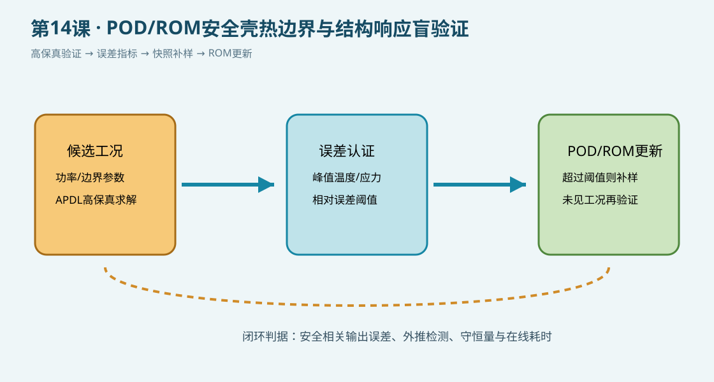

# 第14课：POD/ROM安全壳热边界与结构响应盲验证

## 今日目标

在第11课快照生成基础上，增加误差指标和自适应补样逻辑：先用APDL高保真模型检查候选工况，再把超过阈值的工况加入POD/ROM快照库。误差认证和SVD/POD分解在外部后处理中完成，APDL只负责可追溯的高保真数据。

## 物理问题

模型采用轴对称燃料—间隙—包壳热传导和外表面对流边界。七个功率工况用于演示离线候选点筛选。`tref` 是教学参考值，不能替代已验证的高保真基准；正式研究需用独立ANSYS/MAPDL结果、实验数据或经过验证的参考解。

## 关键命令

- `*DO`：扫描候选参数工况。
- `*GET`：提取峰值温度。
- `*IF`：根据误差阈值标记需要补充快照的工况。
- `*VWRITE`：输出ROM外部程序使用的误差日志。

## 完整脚本

下载 [example.inp](example.inp)。每条可执行命令均附中文行尾注释；`static_only` 表示本机未运行MAPDL。

## 预期结果

脚本应输出每个候选工况的峰值温度和相对误差，并标记超过阈值的工况。外部POD/ROM程序应优先用这些工况补充快照，再用未参与建基的工况验证温度、应力、位移和守恒量。

## POD/ROM工作链

1. 生成初始快照并计算POD基。
2. 在候选工况上运行ROM，记录安全相关输出误差。
3. 对超过阈值的工况调用高保真APDL模型并补入快照。
4. 更新POD基，直到误差、外推检测和在线耗时同时满足要求。

## 验证清单

- `tref` 必须来自独立高保真或实验基准。
- 阈值应针对峰值温度、应力和位移分别设定，不能只看平均误差。
- 补样工况不能同时作为最终盲验证工况。
- 记录网格、单位、材料参数和边界历史，避免误差来源混淆。

## 常见错误

- 把教学参考值当成实验真值。
- 只增加训练样本、不报告补样前后的误差变化。
- 用同一工况既建POD基又验证ROM，产生数据泄漏。

## 练习

1. 将误差指标从峰值温度扩展到包壳热应力和位移。
2. 比较固定均匀采样与误差驱动自适应采样的高保真计算成本。
3. 增加冷却剂温度和接触导热系数作为候选参数，并测试外推工况。
