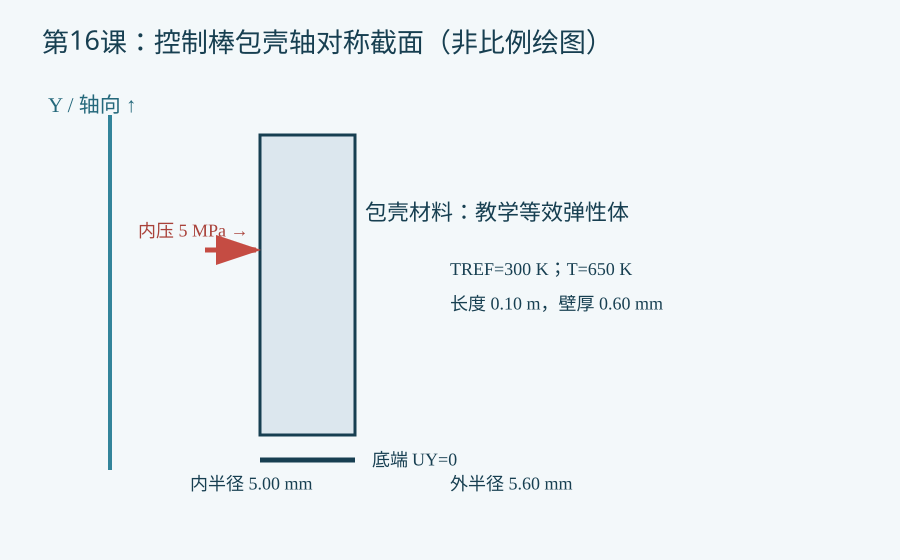

# 第16课：控制棒包壳的热膨胀、热应力与内压组合载荷

## 今日目标

建立一个控制棒包壳的二维轴对称教学模型，比较温升与内压共同作用下的径向位移和等效应力。

## 物理问题与边界

控制棒包壳被简化为等厚圆筒，X 为半径、Y 为轴向。示例采用 SI 单位；半径 5.00/5.60 mm、长度 0.10 m、内压 5 MPa、参考/运行温度 300/650 K，均为教学假设，不是实堆设计数据。材料使用常数弹性模量与线膨胀系数，无吸收体、辐照、接触、蠕变或温度梯度。底端轴向约束会引入附加应力，必须做约束敏感性分析。

## 关键命令

- `ET,1,PLANE182` 定义结构实体单元；`KEYOPT,1,3,1` 设置轴对称。
- `MP,EX/PRXY/ALPX` 给出弹性和热膨胀参数。
- `RECTNG` 与 `AMESH` 生成包壳截面和网格。
- `TREF` 与 `TUNIF` 定义热应变参考和均匀温度。
- `SFL,ALL,PRES` 在所选内表面边线施压；应检查网格边界的法向方向。
- `D,ALL,UY,0` 模拟刚性底端轴向约束；`PLNSOL` 查看位移与等效应力。

## 完整脚本

[下载 example.inp](example.inp)。每条可执行命令有中文行尾注释。示例未经本机 MAPDL 求解，验证状态为 `static_only`。

## 预期结果

径向位移和环向应力应随内压变化；热膨胀在受约束条件下还会产生轴向应力。不能在未求解时填写峰值数值。

## 验证清单

检查：①单位与压力正负方向；②单独压力/单独温升/组合载荷对比；③底端约束反力及刚体运动；④至少两档网格的峰值应力收敛；⑤与薄壁圆筒解析估计交叉比对。

## 常见错误

1. 把 `TREF` 与 `TUNIF` 都设为运行温度，导致无热应变。
2. 内外表面边线选择相反，给错压力；用位移方向验证。
3. 将底端固定引入的局部约束应力误当自由圆筒应力；改变端部条件复算。

## 练习

1. 将内压改为 2、5、8 MPa，记录内表面位移和远离底端处的环向应力趋势。
2. 将均匀温度改为给定轴向温度场，再补充吸收体—包壳接触与高温蠕变模型；先取得经验证的材料曲线。

## 命令依据

[ANSYS PLANE182](https://ansyshelp.ansys.com/public/Views/Secured/corp/v242/en/ans_elem/Hlp_E_PLANE182.html) · [ANSYS SFL](https://ansyshelp.ansys.com/public/Views/Secured/corp/v252/en/ans_cmd/Hlp_C_SFL.html) · [ANSYS TREF](https://ansyshelp.ansys.com/public/Views/Secured/corp/v242/en/ans_cmd/Hlp_C_TREF.html)
