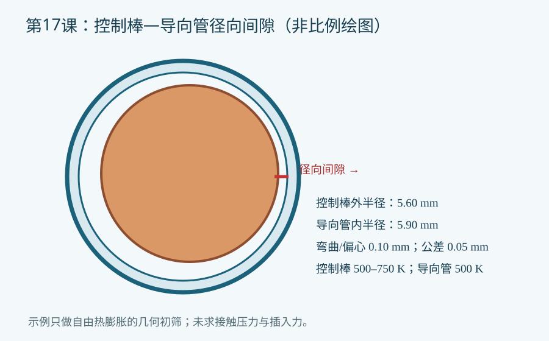

# 第17课：控制棒—导向管间隙、接触与卡涩裕量的几何初筛

## 今日目标

用 APDL 参数循环初筛控制棒受热膨胀后是否可能耗尽与导向管之间的径向间隙，并明确何时必须进入真正的接触—摩擦有限元分析。

## 物理问题与适用边界

以控制棒外半径 5.60 mm、导向管内半径 5.90 mm 为教学几何；控制棒与导向管热膨胀系数分别为 1.6×10⁻⁵/K 和 1.2×10⁻⁵/K。导向管固定在 500 K，控制棒从 500 K 扫描至 750 K；另预留弯曲/偏心 0.10 mm、公差 0.05 mm。全部为虚构教学参数，不得用于真实控制棒卡涩判定。

几何初筛裕量 = 导向管热态内半径 − 控制棒热态外半径 − 弯曲/偏心占用 − 制造公差占用。裕量小于等于零仅表示**需要进一步分析接触风险**，不能推出已经发生摩擦卡涩或给出插入力。

## 关键命令

- `*DO` 扫描温度；`*IF` 标记几何风险。
- `*CFOPEN`、`*VWRITE`、`*CFCLOS` 输出可追溯 CSV。
- `TREF` 在随附的单温度有限元对照模型中设置热应变基准；参数初筛用 `t_ref` 显式计算自由热膨胀。
- `PLANE182` 与 `SOLVE` 求解单一温度下的棒体径向自由膨胀，只校验几何公式，不计算导向管接触。
- 后续真接触模型通常采用 `TARGE169` 与 `CONTA172`，需核查法向、接触状态、摩擦系数和网格；本脚本**没有**建立这对单元或求解接触力。

## 完整脚本

[下载 example.inp](example.inp)。脚本先输出 `lesson17_gap.csv`，再运行一个单温度自由膨胀有限元对照；它没有接触对，不计算卡涩力。本机未运行 MAPDL，状态为 `static_only`。

## 预期结果

控制棒温度升高时，自由膨胀半径增大，间隙裕量应单调下降。有限元对照模型只用于检查 500 K 的径向自由热膨胀；不要预先填写临界温度。

## 验证清单

检查：①温度单位 K 与膨胀系数单位一致；②将弯曲与公差分别置零做极限检验；③对照手算第一行和末行；④核对有限元径向位移与解析热膨胀；⑤若建立接触模型，再检查接触穿透、法向方向、摩擦力收敛和网格敏感性。

## 常见错误

1. 把直径差当径向间隙，造成约两倍的系统误差。
2. 将负间隙直接称为“卡涩”：缺少接触、摩擦、轴向载荷与导向管柔度。
3. 对全棒采用单一温度，忽略轴向温度分布和辐照弯曲。

## 练习

1. 扫描公差和弯曲预留，绘制温度—裕量包络。
2. 建立 `PLANE182` 或三维结构模型及接触对，加入摩擦和插入载荷；以本初筛结果选择最不利工况，并报告求解收敛及实验验证。

## 命令依据

[ANSYS 接触单元综述](https://ansyshelp.ansys.com/public/Views/Secured/corp/v242/en/ans_ctec/Hlp_ctec_anscon.html) · [ANSYS 接触热传递](https://ansyshelp.ansys.com/public/Views/Secured/corp/v242/en/ans_ctec/Hlp_ctec_thercon.html)
