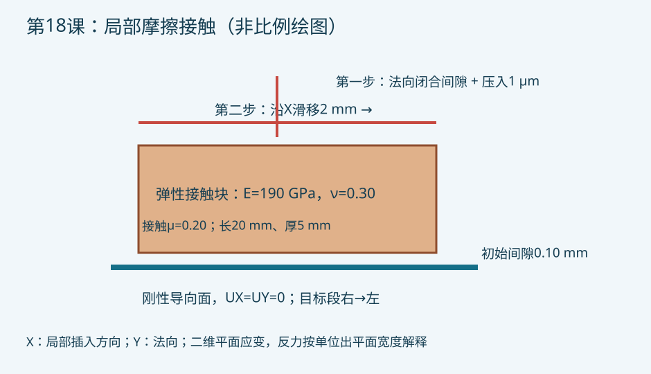

# 第18课：控制棒插入/提出的摩擦接触简化模型

## 今日目标

建立“先闭合法向间隙并预压，再施加切向滑移”的二维面面接触算例，检查反力与库仑摩擦关系。

## 物理问题

控制棒与导向管的局部接触面简化为弹性矩形块与刚性直线目标面。X 对应局部插入方向、Y 对应法向，模型为平面应变；反力解释为单位出平面宽度的 N/m，不能直接当成整根控制棒插入力。长20 mm、厚5 mm、初始间隙0.10 mm；法向闭合后压入1 μm、滑移2 mm、摩擦系数0.20。材料弹性模量190 GPa、泊松比0.30。这些均为教学参数，不对应实际控制棒。

该例只研究机械摩擦路径，不含弯曲、热膨胀、辐照、速度相关摩擦或流体力。导向管柔度被忽略。下一步应使用真实几何、温度场、接触材料和摩擦试验数据。

## 关键命令

- `PLANE183` 与 `KEYOPT,1,3,2`：平面应变弹性接触块。
- `TARGE169` 与 `CONTA172`：刚性目标面与弹性面面接触。
- `MP,MU,2,mu0`：设定接触面的库仑摩擦系数。
- `ESURF`：在所选底边节点上生成接触单元；必须核对选择集。
- `NLGEOM,ON`、`AUTOTS,ON`：考虑滑移非线性并控制子步。
- `D` 与 `TIME`：分阶段施加法向预压和切向滑动。
- `PRRSOL`、`*GET`：提取与汇总加载边反力；`PRESOL,CONT` 检查接触状态。

## 完整脚本

[下载 example.inp](example.inp)。每条可执行命令附中文解释。目标段节点从右向左，接触块位于有向目标线的右侧，依据 ANSYS 目标面法向规则。

## 预期结果

第一步应在间隙闭合后形成压接触；第二步应产生切向摩擦反力。最终充分滑动、无其他切向载荷时，|Fx/Fy| 应接近输入摩擦系数，但不能把这一关系当成所有接触状态都成立。粘着、局部滑动和复杂几何会改变局部力分布。求解验证状态见 metadata.json。

## 验证清单

2026-09-28 已在独立的 `verification` 目录用本机 MAPDL 2023 R1 实际运行，原网格、无摩擦对照和细网格三组均完成两个载荷步，错误计数均为0。

| 工况 | 网格尺寸 | 切向反力 Fx（N/m） | 法向反力 Fy（N/m） | 绝对反力比 |
|---|---:|---:|---:|---:|
| μ=0.20 基线 | 0.50 mm | 175253.19 | -876288.39 | 0.1999949 |
| μ=0 无摩擦对照 | 0.50 mm | 2.44×10⁻⁸ | -871368.92 | 2.80×10⁻¹⁴ |
| μ=0.20 细网格 | 0.25 mm | 180479.15 | -902411.49 | 0.1999965 |

无摩擦对照的切向反力接近零，滑动基线满足预期的库仑摩擦力比。细网格的切向反力增加约2.98%，这两级网格不足以证明完全收敛；工程应用还需更细网格与接触刚度敏感性验证。

基线和无摩擦组各有2条警告：初始接触开放、零反力阶段收敛参考力过小。初始间隙为本例刻意设置，加载边位移约束用于控制闭合路径。细网格另有接触刚度过大的数值警告，应检查单位尺度、接触刚度和穿透误差。求解完成和力比正确不能替代这些检查，也不能验证真实控制棒插入力。详细日志、反力CSV和状态摘要保存在本地验证目录。

1. 核对 SI 单位、初始间隙与位移方向；不能把直径间隙当径向间隙。
2. 打印目标面和接触面，确认法向与节点顺序。
3. 检查每步收敛、接触压力、穿透量和滑动状态。
4. 汇总加载反力与支承反力，核对力平衡；对滑动状态比较库仑反力比。
5. 至少用两档网格和两档子步设置检查反力变化；再用 μ=0 作为零摩擦极限。

## 常见错误

1. 目标段顺序反了，接触一直不闭合；按有向目标线规则复查。
2. 预压与滑移同时一步施加，错过载荷路径；先预压，再滑移。
3. 把二维单位宽度反力直接用作整根控制棒插入力；需完整接触面积和结构模型。

## 练习

1. 将摩擦系数改为0、0.10、0.30，比较滑动反力与接触压力。
2. 把刚性目标替换为弹性导向管，加入第17课的热态间隙与弯曲，验证插入力包络。

## POD/ROM 研究连接

可扫描间隙、摩擦系数与预压位移形成离线快照。接触开闭与粘滑切换可能使全局线性POD基失效；训练/盲测应按接触状态分组，报告峰值插入力误差、穿透误差、在线成本及外推拒绝规则，不能仅凭位移场平均误差认可安全性。

## 命令来源

[TARGE169 官方说明](https://ansyshelp.ansys.com/public/Views/Secured/corp/v242/en/ans_elem/Hlp_E_TARGE169.html) · [CONTA172 官方说明](https://ansyshelp.ansys.com/public/Views/Secured/corp/v252/en/ans_elem/Hlp_E_CONTA172.html) · [VM229 滑块验证算例](https://ansyshelp.ansys.com/public/views/secured/corp/v251/en/ans_vm/Hlp_V_VM229.html)
