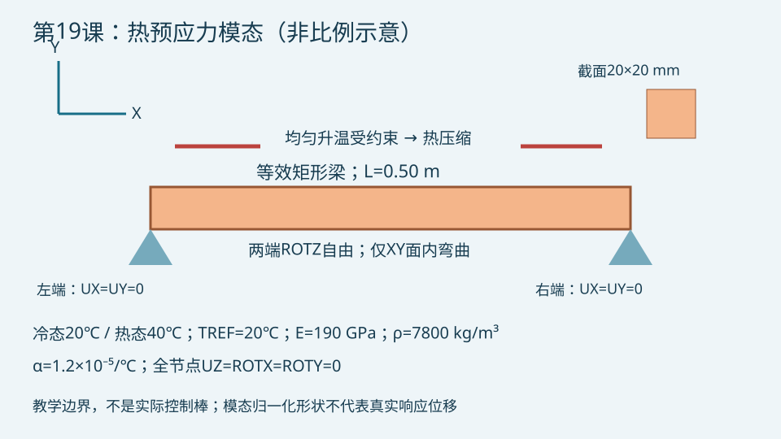

# 第19课：控制棒组件的热预应力模态分析

## 今日目标

完成静力温度载荷到预应力模态的两阶段计算，检查受约束升温引起的频率变化。

## 物理问题

把控制棒组件简化为均质正方形梁：长度0.50 m、边长20 mm，E=190 GPa、密度7800 kg/m³、泊松比0.30、线膨胀系数1.2×10⁻⁵/℃。两端横向铰支且轴向固定，只允许XY面内弯曲。冷态20℃，热态均匀40℃，无应力参考温度20℃。单位为m、N、kg、s、℃。几何、材料与边界均为教学设置，不对应真实控制棒。

均匀升温不必然降低频率：本例是两端轴向约束导致热压缩力，压缩应力刚度使弯曲频率下降。如果右端可自由热膨胀，热压缩机制会消失。真实组件的温度相关弹性模量、分层材料、接触、冷却剂附加质量和支承柔度也会改变频率，本例均不包含。

线性预应力模态描述稳定静力基态附近的小振动，不能替代屈曲、屈曲后或摩擦接触非线性瞬态分析。

## 关键命令

- `BEAM188`：Timoshenko等效梁；`KEYOPT,1,3,3` 使用三次插值。
- `SECTYPE/SECDATA`：定义矩形截面，不能用等效梁代替局部包壳应力评价。
- `MP,DENS`：模态质量必须使用与几何单位一致的密度。
- `TREF` 与 `BF,TEMP`：明确无应力温度和施加温度，热应变取决于温差。
- `D`：两端铰支、轴向固定；抑制出平面自由度后只提取面内模态。
- `ANTYPE,STATIC` 与 `PSTRES,ON`：先保存静力基态的应力刚度。
- `ANTYPE,MODAL` 与 `PSTRES,ON`：模态阶段再次启用预应力效应。
- `MODOPT,LANB` 与 `MXPAND`：提取并展开模态。
- `*GET,MODE,...,FREQ`：频率提取；模态归一化幅值不能视为受迫位移。

## 完整脚本

[下载 example.inp](example.inp)。先冷态、再热态；每种工况各做静力基态与模态求解，输出CSV。命令与参数赋值逐行附中文注释，`*VWRITE`紧随的格式行保持纯格式。

## 预期结果

冷态左端轴向反力接近零。热态反力应与EAαΔT同量级；两端轴向反力相抵。理想铰支Euler梁一阶频率为π/(2L²)√(EI/ρA)，热态近似为f₁,cold√(1−P/Pcr)，其中Pcr=π²EI/L²。此近似忽略剪切与转动惯性，BEAM188结果可能稍低。若P接近或超过临界值，不能继续把线性正频率分析当成可信稳定性评价。

## 验证清单

1. 核查m–N–kg–s单位与密度，检查TREF及温差。
2. 检查冷热静力基态反力，两端平衡和EAαΔT解析对照。
3. 比较40与80单元的前三阶频率；不要只看求解退出码。
4. 将ΔT改为0，确认两种工况频率一致；单独检查自由膨胀边界。
5. 检查频率为正、振型属于预期XY弯曲、压缩力低于理想临界载荷；不将这一教学判据用作真实安全限值。

已在隔离目录使用MAPDL 2023 R1完成以下求解；三组均0错误、0警告。

| 工况 | 单元数 | 温度/℃ | 左端轴向反力/N | f₁/Hz | f₂/Hz | f₃/Hz |
|---|---:|---:|---:|---:|---:|---:|
| 冷态 | 40 | 20 | 0.000 | 178.560337 | 708.604648 | 1574.023379 |
| 热态 | 40 | 40 | 18240.000 | 161.385443 | 691.993159 | 1557.404347 |
| 加密冷态 | 80 | 20 | 0.000 | 178.560337 | 708.604658 | 1574.023425 |
| 加密热态 | 80 | 40 | 18240.000 | 161.385444 | 691.993169 | 1557.404394 |
| 零温升对照A | 40 | 20 | 0.000 | 178.560337 | 708.604648 | 1574.023379 |
| 零温升对照B | 40 | 20 | 0.000 | 178.560337 | 708.604648 | 1574.023379 |

热态两端轴向反力相抵，总残差约−2.18×10⁻¹¹ N；反力与EAαΔT=18240 N一致。前三阶频率40→80单元的最大相对变化为0.00000302%。零温升对照的两次频率完全一致。

Euler–Bernoulli近似的一阶频率为冷态179.0395 Hz、热态161.8919 Hz；BEAM188分别低约0.268%与0.313%，符合剪切与转动惯性影响的预期。热压缩力与理想Euler临界载荷之比约0.1824。解析对照和网格检查仅验证该教学梁，不能证明真实控制棒的安全性。

## 常见错误

1. 只在模态阶段写PSTRES、没有有效静力基态，导致预应力缺失。两阶段都要启用并核查反力。
2. 将温度直接当温差，或误留轴向自由端，却仍宣称产生热压缩力。明确TREF与UX约束。
3. 认为“模态频率下降”就等于结构失效。需区分约束、剪切效应、材料退化、屈曲及实际激励频带。

## 练习

1. 将温升改为0、10、20℃，比较反力和前三阶频率，绘制f₁随P/Pcr变化并检验解析近似。
2. 解除右端UX固定，再引入弹簧支承或冷却剂附加质量，区分热约束和质量变化的影响。

## POD/ROM研究连接

参数扫描可输出温差、支承刚度、静力应力和质量归一化模态，形成热态模态降阶基。接近频率交叉或屈曲时必须用振型关联（例如MAC）跟踪模态，不能简单按频率序号插值。比较常温固定基与温度相关基对热态频率、受迫响应及离线/在线成本的误差。本教程没有训练POD模型，也没有计算谐响应。

## 官方来源

[BEAM188](https://ansyshelp.ansys.com/public/Views/Secured/corp/v242/en/ans_elem/Hlp_E_BEAM188.html) · [PSTRES](https://ansyshelp.ansys.com/public/Views/Secured/corp/v252/en/ans_cmd/Hlp_C_PSTRES.html)。采用线性基态的传统PSTRES流程；涉及非线性接触基态应另核对线性扰动流程。
