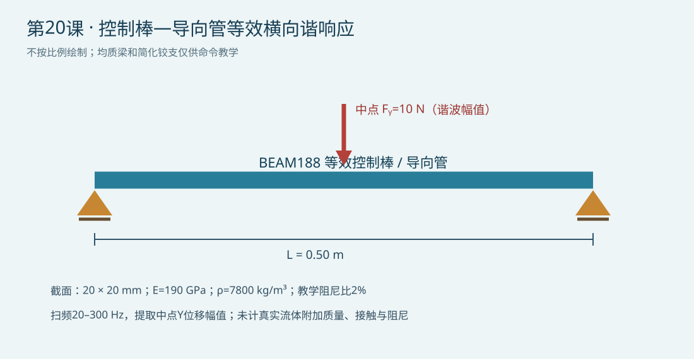

# 第20课：控制棒—导向管等效横向谐响应与流致载荷

## 今日目标

用 MAPDL 对简化控制棒梁施加周期横向力，得到中点位移随激励频率变化的幅值，认识谐响应与上节模态频率的关系。

## 物理问题与边界

本例以均质、线性弹性的0.50 m梁代表控制棒组件的一个教学自由度，采用20 mm×20 mm等效截面。X为轴向、Y为横向；两端限制Y位移、转角ROTZ自由，左端约束UX，右端轴向自由。其余出平面自由度固定。中点受10 N正弦横向力。材料E=190 GPa、密度7800 kg/m³、泊松比0.30，结构阻尼比取2%作为假设。扫频20–300 Hz。单位制为m、N、kg、s、Hz和Pa。

“流致载荷”只表示给定的等效激励，不是CFD计算的真实流体力。模型不含导向管接触、真实控制棒复合截面、附加流体质量、温度梯度或流动压力脉动谱，因此不能用于卡涩或振动安全裕量判定。示意图不按比例绘制。

## 关键命令

1. `ET,1,BEAM188`：建立含弯曲和惯性的三维梁单元。
2. `SECTYPE`、`SECDATA`：定义用于教学的矩形截面。
3. `MP,DENS`：提供谐响应所需惯性质量。
4. `D`、`F`：设置两端导向约束和中点简谐力幅值。
5. `ANTYPE,HARMIC`、`HROPT,FULL`：开启全矩阵线性谐响应；这里未构造POD降阶求解器。
6. `DMPRAT`：设置假定的结构阻尼比，不能代表测得的实际阻尼。
7. `HARFRQ`、`NSUBST`：指定扫频范围与求解频点。
8. `/POST26`、`NSOL`、`PRCPLX,1`、`PRVAR`：按频率列出中点复位移的幅值与相位。

## 完整脚本

下载 [example.inp](example.inp)。可执行命令与参数赋值均有行尾中文注释；用独立求解目录运行，避免覆盖其他分析结果。

## 预期结果

模型的理想铰支Euler–Bernoulli一阶频率解析估算约179 Hz；BEAM188因剪切/转动惯性可略有偏差。若网格、阻尼和边界正确，位移幅值应在一阶频率附近明显增大，但不应凭频率最大点直接认定真实控制棒共振。实际结果以求解输出为准。本机隔离运行在获取许可证前停止（FlexNet -97,121），因此今日验证状态为 `static_only`，不声称已求解出频响曲线。

## 验证清单

- 核对m、N、kg、s、Hz和Pa单位，尤其载荷幅值和密度。
- 检查约束后无自由刚体运动；比较低频位移与静力中点位移解析量级。
- 对比40/80单元下的峰值频率和峰值位移，并将扫频步长由2 Hz减半。
- 改变阻尼比及载荷幅值，检查线性响应趋势；真实阻尼必须靠试验或可信模型标定。
- 若后续加入附加流体质量或导向接触，重新核对模态、峰值和边界适用范围。

## 常见错误

1. 忽略密度或流体附加质量导致峰值频率偏差；先核对质量来源。
2. 使用过粗扫频点遗漏窄共振峰；在峰值附近加密并做步长敏感性检查。
3. 把理想正弦点力当作真实流致载荷谱；需要流场数据或实验激励证据。

## 练习

1. 将阻尼比在1%、2%、5%间变化，比较中点幅值与峰值位置，并解释为何阻尼不是从几何推得。
2. 用实测导向管支承刚度与流体附加质量替代简化铰支，检验控制棒接触/卡涩相关频段的频率响应；没有数据时保持教学假设，不给安全结论。

## 命令依据

- [Ansys 结构分析指南：全矩阵谐响应](https://ansyshelp.ansys.com/public/Views/Secured/corp/v242/en/ans_str/Hlp_G_STR4_5.html)
- [Ansys 命令参考：PRCPLX 的幅值/相位输出](https://ansyshelp.ansys.com/public/views/secured/corp/v242/en/ans_cmd/Hlp_C_PRCPLX.html)
- [Ansys 命令参考：NSOL 中点位移变量](https://ansyshelp.ansys.com/public/Views/Secured/corp/v242/en/ans_cmd/Hlp_C_NSOL.html)

本教程不构成真实反应堆安全评价，工程应用需经验证材料、边界、限值与质量保证。
