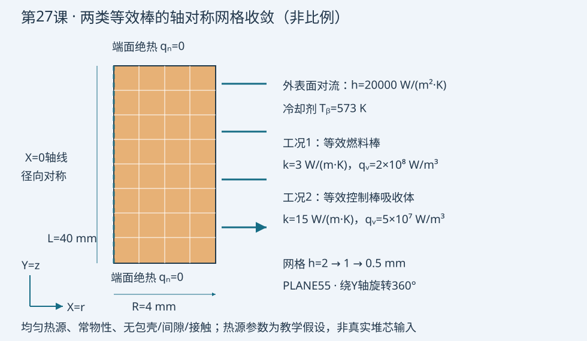

# 第27课：燃料棒与控制棒案例的网格独立性自动循环

2026-10-09

## 今日目标

自动完成两类等效圆柱的三套网格计算，用解析温升误差和热平衡检查收敛。

## 物理问题

用轴对称圆柱代表等效燃料棒和控制棒吸收体，半径4 mm、长度40 mm。X为径向，Y为轴向，模型绕Y轴旋转360°。外表面对流，h=20000 W/(m²·K)，冷却剂573 K；两端绝热。采用常导热率和均匀体积热源：燃料k=3 W/(m·K)、qᵥ=2×10⁸ W/m³；吸收体k=15 W/(m·K)、qᵥ=5×10⁷ W/m³。

这些参数仅为教学假设。模型不含包壳、间隙、温度依赖性、辐照或轴向功率变化；不代表真实棒温度限值。两类材料分别计算，不在同一圆柱中混合。



## 关键命令

- `PLANE55 / KEYOPT,1,3,1`：四节点轴对称热单元，轴线为Y；不是平面薄板。
- `*DO / *DIM`：双循环计算六个工况，保留九列结果。
- `ACLEAR / ADELE`：重建网格时仅清除旧面积网格和几何，保留材料、数组及循环参数。
- `RECTNG / MSHKEY / ESIZE`：重建圆柱子午面及2、1、0.5 mm映射网格。
- `BFE,HGEN`：全体单元施加体积热源W/m³。
- `NSEL / SF,CONV`：只选外表面，依次输入h与冷却剂温度；端面无外加热流。
- `ANTYPE,STATIC,NEW`：每次网格重新求解稳态热分析。
- `NODE / *GET`：读取两套固定物理位置的温度，不能比较不同位置的节点编号。
- `*VWRITE`：输出CSV；*VLEN,1限制每次写一行，九列总宽125字符，低于128字符限制；下一行格式描述符保持纯格式，不能附加注释。

## 完整脚本

```apdl
/CLEAR,NOSTART ! 仅用于独立批处理实例；m、W、K单位制
/FILNAME,lesson27 ! 本课结果文件前缀
/PREP7 ! 创建轴对称稳态导热模型
ET,1,PLANE55 ! 四节点二维热单元
KEYOPT,1,3,1 ! 轴对称；X为半径，Y为轴线
MP,KXX,1,3 ! 等效燃料导热率3 W/(m K)，教学常数
MP,KXX,2,15 ! 等效控制棒吸收体导热率15 W/(m K)
rad=0.004 ! 圆柱半径4 mm
alen=0.040 ! 圆柱长度40 mm
hcoef=20000 ! 外表面对流系数W/(m2 K)
tbulk=573 ! 冷却剂温度K
pi=ACOS(-1) ! 圆周率，角度函数采用默认弧度
*DIM,res,ARRAY,6,9 ! 六行：工况、尺寸、节点数、中心温度、外温、解析中心温度、温升相对误差、热平衡误差、网格变化
runid=0 ! 计算次数计数器
FINISH ! 结束初始化
*DO,icase,1,2 ! 两个等效材料工况，均不含包壳和间隙
*IF,icase,EQ,1,THEN ! 燃料棒工况
qvol=2E8 ! 体积热源W/m3
kcond=3 ! 对应燃料导热率
*ELSE ! 控制棒吸收体工况
qvol=5E7 ! 体积热源W/m3，教学假设
kcond=15 ! 对应吸收体导热率
*ENDIF ! 完成工况选择
*DO,igrid,1,3 ! 网格尺寸依次为2、1、0.5 mm
runid=runid+1 ! 每次网格计算占一行
hmesh=rad/(2**igrid) ! 径向和轴向名义网格尺寸m
/PREP7 ! 开始本次网格重建
ALLSEL,ALL ! 清理和划分前恢复所有选择
*IF,runid,GT,1,THEN ! 首次运行没有旧网格，不执行清除
ACLEAR,ALL ! 删除旧面积网格，保留数组和循环参数
ADELE,ALL,,,1 ! 删除已清网格面积及其独占线、关键点
*ENDIF ! 完成旧模型清理
RECTNG,0,rad,0,alen ! 轴对称圆柱子午面矩形
TYPE,1 ! 选热单元
MAT,icase ! 当前工况的材料号
MSHKEY,1 ! 映射四边形网格
MSHAPE,0,2D ! 四边形形状
ESIZE,hmesh ! 本次名义网格尺寸m
AMESH,ALL ! 对当前唯一面积划分网格
ALLSEL,ALL ! 热源施加到全部单元
BFE,ALL,HGEN,,qvol ! 全部单元均匀体积生热W/m3
NSEL,S,LOC,X,rad ! 仅外圆柱表面节点；不选轴线或端面内部
SF,ALL,CONV,hcoef,tbulk ! 对流系数和冷却剂温度，端面自然绝热
ALLSEL,ALL ! 求解前恢复全部节点和单元
*GET,nnodes,NODE,0,COUNT ! 记录当前网格节点数
FINISH ! 离开前处理
/SOLU ! 求解当前工况
ANTYPE,STATIC,NEW ! 新的稳态热分析，不能沿用上一网格结果
OUTRES,ALL,ALL ! 保存结果
SOLVE ! 求解温度场
FINISH ! 结束求解
/POST1 ! 后处理
SET,LAST ! 读取本次结果
ALLSEL,ALL ! 节点定位前恢复全部节点
ncenter=NODE(0,alen/2,0) ! 轴线中点节点，三套网格均包含该位置
nouter=NODE(rad,alen/2,0) ! 外圆柱中点节点
*GET,tc,NODE,ncenter,TEMP ! 当前网格中心温度K
*GET,to,NODE,nouter,TEMP ! 当前网格外表面温度K
texact=tbulk+qvol*rad/(2*hcoef)+qvol*rad**2/(4*kcond) ! 解析中心温度K
qinput=qvol*pi*rad**2*alen ! 整根圆柱输入热功率W；360度轴对称
qout=hcoef*2*pi*rad*alen*(to-tbulk) ! 轴向均匀条件下整根圆柱散热W
errtemp=ABS(tc-texact)/(texact-tbulk) ! 用温升归一化，避免绝对温度掩盖误差
errheat=ABS(qout-qinput)/qinput ! 热平衡相对误差
change=-1 ! 第一套网格无前序比较，以-1明确表示
*IF,igrid,GT,1,THEN ! 与同材料前一套粗网格比较
change=ABS(tc-res(runid-1,4))/(texact-tbulk) ! 网格变化的温升相对量
*ENDIF ! 完成粗细网格比较
res(runid,1)=icase ! 第1列工况号
res(runid,2)=hmesh ! 第2列网格尺寸m
res(runid,3)=nnodes ! 第3列节点数
res(runid,4)=tc ! 第4列中心温度K
res(runid,5)=to ! 第5列外温K
res(runid,6)=texact ! 第6列解析中心温度K
res(runid,7)=errtemp ! 第7列解析温升相对误差
res(runid,8)=errheat ! 第8列热平衡相对误差
res(runid,9)=change ! 第9列粗细网格变化
FINISH ! 结束本次后处理
*ENDDO ! 完成三套网格
*ENDDO ! 完成两类等效棒
*CFOPEN,mesh_study,csv ! 所有求解完成后一次性输出，覆盖旧文件
*DO,irow,1,6 ! 逐行导出九列结果
*VLEN,1 ! 每次只输出当前一行，避免数组自动向量循环重复输出
*VWRITE,res(irow,1),res(irow,2),res(irow,3),res(irow,4),res(irow,5),res(irow,6),res(irow,7),res(irow,8),res(irow,9) ! 紧邻下一行是九列CSV纯格式，不追加注释
(E13.6,8(',',E13.6))
*ENDDO ! 完成六行输出
*CFCLOS ! 关闭结果文件
FINISH ! 本批处理结束
```

## 预期结果

解析解为 T(r)=Tᵦ+qᵥR/(2h)+qᵥ(R²−r²)/(4k)。燃料中心解析值859.6667 K，外温593 K；吸收体中心591.3333 K，外温578 K。这些为解析计算值，有限元数值必须从验证目录读取。

CSV依次记录工况号、网格尺寸m、节点数、中心温度K、外温K、解析中心温度K、中心温升相对误差、热平衡误差、同材料粗细网格温升变化。每个工况第一行最后一列为−1，表示无前序网格。

温升相对误差采用|T中心−T解析|/(T解析−Tᵦ)，避免用绝对开尔文温度造成误差看似很小。三套网格只证明本工况的趋势；不要未经单调性、渐近区和收敛阶检查就给出GCI。

## 验证清单

- 核对m、W、K单位，以及轴对称完整圆柱热量qᵥπR²L；不能再乘2π。
- 两端无热流、轴线对称、只有外侧对流。外表面温度沿轴向应一致。
- 由于轴向均匀，用中点外温计算Qout=h·2πRL·(T外−Tᵦ)，与Qin比较；轴向热源变化时必须对外表面温度积分。
- 分别检查2、1、0.5 mm温升误差和粗细差；约定1%是本课演示判据，不是核工程验收标准。
- 网格节点与单元数应增加；CSV应恰好六行、九列。参数数组不被循环中的清理操作删除。
- POD前处理需先控制全阶离散误差，所有快照投影到共同物理网格，再区分截断、插值和全阶误差。

## 常见错误

1. 循环中使用`/CLEAR`会删除参数和数组；改用面积网格清理。
2. 把PLANE55默认平面形式当圆柱，热源和表面积不一致；必须设置轴对称。
3. 外温变化小就宣称网格独立：外温由整体能量守恒约束，中心温升及梯度仍可能有显著离散误差。

## 练习题

1. 把h减半，比较外温、中心温升和网格误差；解释边界热阻变化为何不保证内部梯度更准确。
2. 添加包壳和燃料间隙，分别细化各区；随后引入轴向余弦功率分布，改用外表面积分校核热平衡，并讨论今日LBE棒束热点为何不能由均匀加热解预测。

## 命令依据

- [PLANE55：Ansys官方单元参考](https://ansyshelp.ansys.com/public/Views/Secured/corp/v242/en/ans_elem/Hlp_E_PLANE55.html)
- [SF：Ansys官方命令参考](https://ansyshelp.ansys.com/public/Views/Secured/corp/v242/en/ans_cmd/Hlp_C_SF.html)
- [ADELE：Ansys官方命令参考](https://ansyshelp.ansys.com/public/Views/Secured/corp/v242/en/ans_cmd/Hlp_C_ADELE.html)

## 验证状态

static_only：已完成公式、参数、逐行注释及格式行静态检查。隔离MAPDL返回7，许可服务不可用（FlexNet −97,121），未执行求解；不预填有限元数值。
